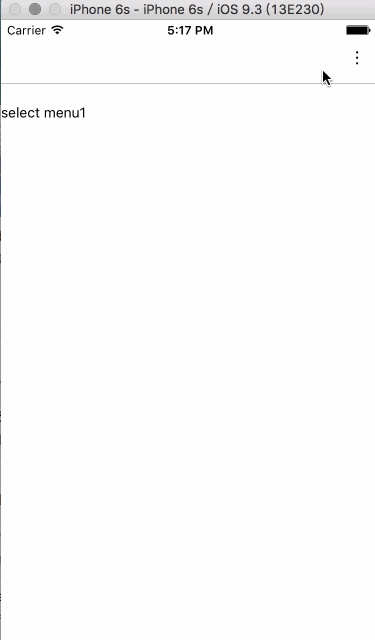

#react-native-menu-button
dropdown menu button for react native

### 1.0.0 版本更新
fixed issue [https://github.com/KenHky/react-native-menu-button/issues/4](https://github.com/KenHky/react-native-menu-button/issues/4)
解决了转屏后menu计算位置不对的问题。
重构了一次代码，语法更符合规范。
请使用 0.25+ 版本的react native。
api 没有变化。

### 简介

这是一个 react-native 的 menubutton 组件,支持 iOS 和 android,但是安卓的样式和 iOS 的有一些差异。

| iOS | Android |
| --- | ------- |
|  |  |

### API
buttonStyle：按钮的样式，可覆盖默认样式。

optionsStyle：menu 组的样式，可覆盖默认的样式。

menuGroup：menu 数据，格式为[{key:num or str,value:num or str,text:str,hide:Boolean}]。value 为点击发生后传的值，text 为显示的字符串，hide 为 true 时隐藏该条数据，默认为 false。

onSelect：选择一个选项后的回调，参数为 menu 数据的 value 值。

button：可定制按钮，默认为{(<Text style={{ fontSize: 20,textAlign:"right" }}>&#8942;</Text>)} (0.1.0新增)。

optionStyle: menu items style，每个 menu item 的样式。(0.2.0新增)

selectedOptionStyle: menu item style when selected，选择后的 item 样式，默认无。(0.2.0新增)

optionTextStyle: menu item text style ，每个 menu item text 的样式，默认无。(0.3.0新增)

selectedOptionTextStyle: menu item text style when selected，选择后的 item text 的样式，默认无。(0.3.0新增)

### demo

    cd demo
    npm install
    react-native run-android
    react-native run-ios

### 安装
    npm install react-native-menu-button ——save
    
###使用
```javascript
import React, { Component } from 'react';
import {
  AppRegistry,
  StyleSheet,
  Text,
  View
} from 'react-native';
import MenuButton from 'react-native-menu-button'

export default class rndemo extends Component {
  constructor(props) {
    super(props);
    this.state = {
      selectData:""
    };
  }
  _handleOnSelect (value) {
    this.setState({selectData:value})
  }
  render() {
    menuGroup= [
      {key:"0",value:"menu1",text:"menu1"},
      {key:"1",value:"menu2",text:"menu2"},
      {key:"2",value:"菜单3",text:"菜单3"},
      {key:"3",value:"菜单4",text:"菜单4"},
    ]
    return (
      <View>
        <View style={styles.top}>
          <MenuButton  
            buttonStyle={[styles.rightButton]} 
            menuGroup={menuGroup}
            onSelect={this._handleOnSelect.bind(this)} 
            optionSelectedStyle={{backgroundColor:"red"}}
          />
        </View>
        <Text style={styles.text}>{`select ${this.state.selectData}`}</Text>
      </View>
    )
  }
}

const styles = StyleSheet.create({
  top:{
    backgroundColor: '#FFFFFF',
    paddingTop: 20,
    top: 0,
    height: 64,
    right: 0,
    left: 0,
    borderBottomWidth: 0.5,
    borderBottomColor: '#828287',
    position: 'relative',
  },
  text:{
    marginTop:20,
  },
  rightButton: {
    width: 100,
    height: 37,
    position: 'absolute',
    bottom: 8,
    right: 2,
    padding: 8
  },
})

AppRegistry.registerComponent('rndemo', () => rndemo)
```

###协议
MIT


